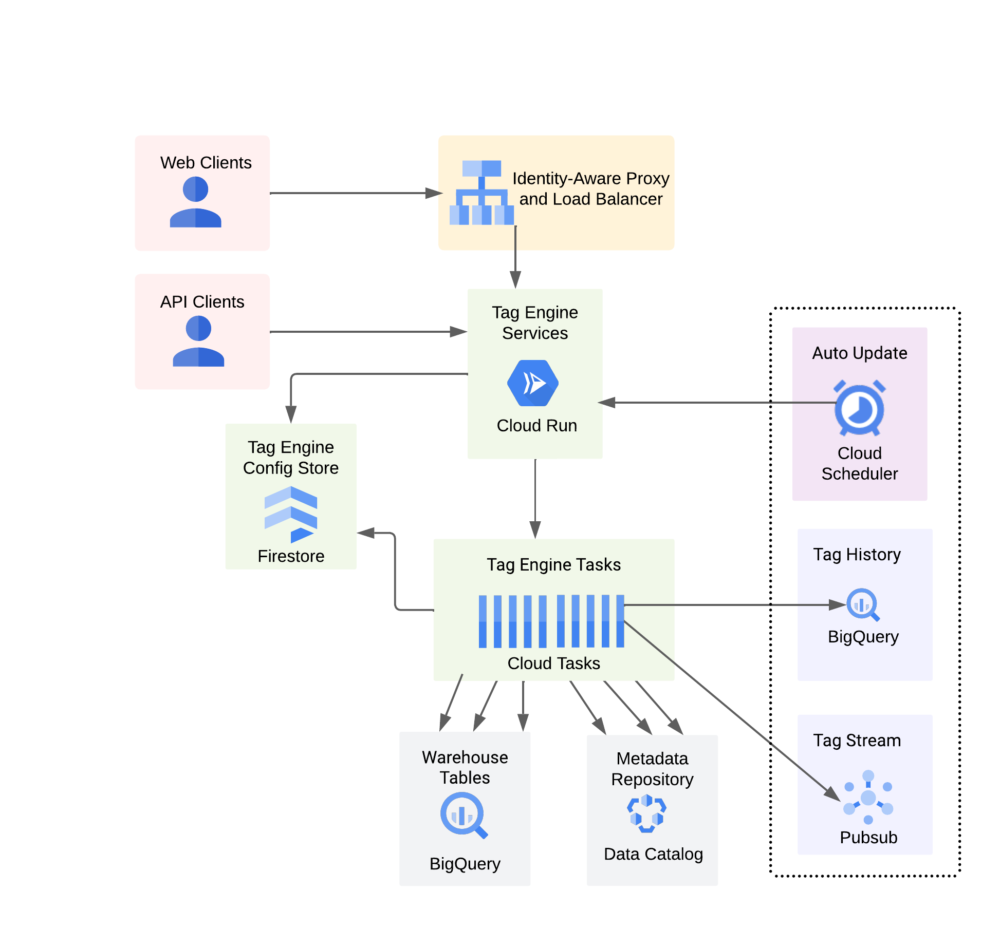

## Tag Engine 2.0
This branch contains the Tag Engine 2.0 application, a recent release of Tag Engine v2 that is hosted on Cloud Run (instead of App Engine) and is [VPC-SC compatible](https://cloud.google.com/vpc-service-controls/docs/supported-products). Tag Engine 2.0 supports authentication and the ability for multiple teams to securely tag their own data assets. 

Tag Engine is an open-source extension to Google Cloud's Data Catalog. Tag Engine automates the tagging of BigQuery tables and views as well as data lake files in Cloud Storage. You create a configuration, which contains SQL expressions that define how to populate the fields in the tags. Tag Engine runs the configuration either on demand or on a pre-defined schedule.

If you are new to Tag Engine, you may want to walk through [this tutorial](https://cloud.google.com/architecture/tag-engine-and-data-catalog). Note that the tutorial was written for Tag Engine v1 (as opposed to v2), but it will give you a sense of how Tag Engine works. We plan to publish a second tutorial for Tag Engine v2 soon. Stay tuned! 

This README is organized into four parts:  <br>
- Part 1: [Deploying Tag Engine v2](#deploy) <br>
- Part 2: [Testing your Setup with a User Account](#testa)  <br>
- Part 3: [Testing your Setup with a Service Account](#testb)  <br>
- Part 4: [What To Do Next](#next)  <br> 

### <a name="deploy"></a> Deploying Tag Engine v2

The deployment of Tag Engine on Cloud Run is more complex than on App Engine. The Cloud Run service that serves the Tag Engine UI is secured with a Load Balancer, OAuth, and with Identity-Aware Proxy (IAP). Here's a high-level diagram of the main components: <br>

The following procedure deploys Tag Engine v2 on Google Cloud. The first five steps are manual, the last step is done through Terraform. 

1. Create (or designate) two service accounts:

- A service account that runs the Tag Engine Cloud Run service, referred to as `TAG_ENGINE_SA`. 
- A service account that performs the tagging in Data Catalog, and sourcing the contents of those tags from BigQuery, referred to as `TAG_CREATOR_SA`. <br><br>


2. Register and purchase a domain:

Enable the [Cloud DNS API](https://console.cloud.google.com/marketplace/product/google/dns.googleapis.com)
Open [Cloud Domains](https://console.cloud.google.com/net-services/domains/registrations/list) and register a domain for the Tag Engine UI<br><br>


3. Create a pair of OAuth clients:

Open [API Credentials] (https://console.cloud.google.com/apis/credentials)<br>

Click on Create Credentials and select OAuth client ID and choose the following settings:<br>

Application type: web application<br>
Name: tag-engine-oauth<br>
Authorized redirects URIs: https://[YOUR_DOMAIN]/oauth2callback<br> 
Click Create<br>
Download the credentials as `client_secret.json` and place the file in the root of the `datacatalog-tag-engine` directory<br><br> 

Note: [YOUR_DOMAIN] refers to your domain name (e.g. tagengine.app)<br><br> 

Click on Create Credentials and select OAuth client ID and choose the following settings:<br>

Application type: web application<br>
Name: IAP-tag-engine-backend<br>
Click Create<br><br>

Reopen IAP-tag-engine-backend<br> 
Copy the Client ID<br>
Add authorized redirect URI: https://iap.googleapis.com/v1/oauth/clientIds/[CLIENT_ID].apps.googleusercontent.com:handleRedirect<br>
Click Save<br><br>

Note: [CLIENT_ID] refers to your OAuth client ID (e.g. 111111111111-xxxxxxxxxxxxxxxxxxxxxxxxxxxxxxx.apps.googleusercontent.com)<br><br>


4. Open `datacatalog-tag-engine/tagengine.ini` and set the following variables in this file. 

```
TAG_ENGINE_PROJECT
TAG_ENGINE_REGION  
BIGQUERY_REGION
TAG_ENGINE_SA
TAG_CREATOR_SA
ENABLE_AUTH  
```

A couple of notes:

- The variable `ENABLE_AUTH` is a boolean. When set to `True`, Tag Engine verifies that the end user is authorized to use `TAG_CREATOR_SA` prior to processing their tag requests. This is the recommended value. 

- The `tagengine.ini` file also has two variables, `INJECTOR_QUEUE` and `WORK_QUEUE`. Those determine the names of the tasks queues. You do not need to change them. If you change their name, you need to change them in the `deploy/variables.tf` as well.<br><br> 


5. Set the Terraform variables:

Open `deploy/variables.tf` and change the default value for each variable.<br>
Open `deploy/terraform.tfvars` and set the three remaining variables. <br>
Save both files.<br><br> 


6. Run the Terraform scripts:

```
cd deploy
terraform plan
terraform apply
```

Note: if you wish to deploy using gcloud instead of Terraform, consult the [manual deployment procedure](https://github.com/GoogleCloudPlatform/datacatalog-tag-engine/tree/cloud-run/docs/manual_deployment.md).

### <a name="testa"></a> Part 2: Testing your Tag Engine setup with a user account

1. Create the sample `data_governance` tag template:

```
git clone https://github.com/GoogleCloudPlatform/datacatalog-templates.git 
cd datacatalog-templates
python create_template.py $TAG_ENGINE_PROJECT $TAG_ENGINE_REGION data_governance.yaml 
```
<br>

2. Authorize a user account to use $TAG_CREATOR_SA and to invoke the Tag Engine Cloud Run service:

```
export USER_ACCOUNT="username@example.com"

gcloud iam service-accounts add-iam-policy-binding $TAG_CREATOR_SA \
    --member=user:$USER_ACCOUNT --role=roles/iam.serviceAccountUser 


gcloud run services add-iam-policy-binding tag-engine \
    --member=user:$USER_ACCOUNT --role=roles/run.invoker \
    --region=$TAG_ENGINE_REGION	
```
<br>

3. Test your Tag Engine UI path:

- Open a browser window
- Navigate to https://[YOUR_DOMAIN] 
- You should be prompted to sign in to `iap.googleapis.com`
- Once signed in, you should be directed to the Tag Engine home page (i.e. https://[YOUR_DOMAIN]/home)
- Enter your template id, template project, and template region
- Enter your $TAG_CREATOR_SA as the service account
- Click on `Search Tag Templates` to continue to the next step and create a tag configuration

If you encouter a 500 error, open the Cloud Run logs to troubleshoot. 
<br><br>


4. Test your Tag Engine API path: 

a) Generate an OAUTH token for your `USER_ACCOUNT`:

```
gcloud auth application-default login
export OAUTH_TOKEN=$(gcloud auth application-default print-access-token)
```

b) Generate an IAM token (aka Bearer token) for authenticating to the Tag Engine Cloud Run service:

```
gcloud auth login
export IAM_TOKEN=$(gcloud auth print-identity-token)
```

c) Create a dynamic table config:

Before running the next command, update the project and dataset values in `tests/configs/dynamic_table/dynamic_table_ondemand.json`. 

```
export TAG_ENGINE_URL=$SERVICE_URL

curl -X POST $TAG_ENGINE_URL/create_dynamic_table_config -d @tests/configs/dynamic_table/dynamic_table_ondemand.json \
	-H "Authorization: Bearer $IAM_TOKEN" \
	-H "oauth_token: $OAUTH_TOKEN"
```

The output from this command should look similar to:

```
{
  "config_type": "DYNAMIC_TAG_TABLE",
  "config_uuid": "416f9694e46911ed96c5acde48001122"
}
```

d) Trigger the job:

Before running the next command, update the `config_uuid` with your value. 

```
curl -i -X POST $TAG_ENGINE_URL/trigger_job \
  -d '{"config_type":"DYNAMIC_TAG_TABLE","config_uuid":"c255f764d56711edb96eb170f969c0af"}' \
  -H "Authorization: Bearer $IAM_TOKEN" \
  -H "oauth_token: $OAUTH_TOKEN"
```

The output from this command should look similar to:

```
{
  "job_uuid": "9c13357ee46911ed96c5acde48001122"
}
```

e) View the job status:


Before running the next command, update the `job_uuid` with your value. 

```
curl -X POST $TAG_ENGINE_URL/get_job_status -d '{"job_uuid":"9c13357ee46911ed96c5acde48001122"}' \
	-H "Authorization: Bearer $IAM_TOKEN" \
	-H "oauth_token: $OAUTH_TOKEN"
```

The output from this command should look like this:

```
{
  "job_status": "SUCCESS",
  "task_count": 1,
  "tasks_completed": 1,
  "tasks_failed": 0,
  "tasks_ran": 1
}
```

Open the Data Catalog UI and verify that your tag was successfully created. If your tags are not there or if you encounter an error with the previous commands, open the Cloud Run logs and investigate. 
<br><br>

### <a name="testb"></a> Part 3: Testing your Tag Engine Setup with a Service Account

1. Create the sample `data_governance` tag template (you can skip this step if you went through the previous test procedure):

```
git clone https://github.com/GoogleCloudPlatform/datacatalog-templates.git 
cd datacatalog-templates
python create_template.py $TAG_ENGINE_PROJECT $TAG_ENGINE_REGION data_governance.yaml
```
<br>

2. Authorize a service account to use $TAG_CREATOR_SA and to invoke the Tag Engine Cloud Run service:

```
export CLIENT_SA="tag-engine-client@<PROJECT>.iam.gserviceaccount.com"

gcloud iam service-accounts add-iam-policy-binding $TAG_CREATOR_SA \
    --member=serviceAccount:$CLIENT_SA --role=roles/iam.serviceAccountUser 


gcloud run services add-iam-policy-binding tag-engine \
    --member=serviceAccount:$CLIENT_SA --role=roles/run.invoker \
    --region=$TAG_ENGINE_REGION	
```
<br>

3. Generate an OAUTH token for your `CLIENT_SA`:

```
export GOOGLE_APPLICATION_CREDENTIALS="/path/to/your/keyfile.json"
gcloud auth activate-service-account $CLIENT_SA --key-file $GOOGLE_APPLICATION_CREDENTIALS
export OAUTH_TOKEN=$(gcloud auth application-default print-access-token)
```
<br>

4. Generate an IAM token (aka Bearer token) for authenticating to the Tag Engine Cloud Run service:

```
gcloud auth login
export IAM_TOKEN=$(gcloud auth print-identity-token)
```
<br>

5. Create a dynamic table config:

Before running the next command, update the project and dataset values in `tests/configs/dynamic_table/dynamic_table_ondemand.json`. 

```
export TAG_ENGINE_URL=$SERVICE_URL

curl -X POST $TAG_ENGINE_URL/create_dynamic_table_config -d @tests/configs/dynamic_table/dynamic_table_ondemand.json \
	-H "Authorization: Bearer $IAM_TOKEN" \
	-H "oauth_token: $OAUTH_TOKEN"
```

The output from this command should look similar to:

```
{
  "config_type": "DYNAMIC_TAG_TABLE",
  "config_uuid": "416f9694e46911ed96c5acde48001122"
}
```
<br>

6. Trigger the job:

Before running the next command, update the `config_uuid` with your value. 

```
curl -i -X POST $TAG_ENGINE_URL/trigger_job \
  -d '{"config_type":"DYNAMIC_TAG_TABLE","config_uuid":"c255f764d56711edb96eb170f969c0af"}' \
  -H "Authorization: Bearer $IAM_TOKEN" \
  -H "oauth_token: $OAUTH_TOKEN"
```

The output from this command should look similar to:

```
{
  "job_uuid": "9c13357ee46911ed96c5acde48001122"
}
```
<br>

7. View the job status:

Before running the next command, update the `job_uuid` with your value. 

```
curl -X POST $TAG_ENGINE_URL/get_job_status -d '{"job_uuid":"9c13357ee46911ed96c5acde48001122"}' \
	-H "Authorization: Bearer $IAM_TOKEN" \
	-H "oauth_token: $OAUTH_TOKEN"
```

The output from this command should look like this:

```
{
  "job_status": "SUCCESS",
  "task_count": 1,
  "tasks_completed": 1,
  "tasks_failed": 0,
  "tasks_ran": 1
}
```

Open the Data Catalog UI and verify that your tag was successfully created. If not, open the Cloud Run logs and investigate the problem. 
<br><br>

### <a name="next"></a> Part 4: Next Steps

1. Explore additional API methods and run them through curl commands:

Open `tests/unit_test.sh` and go through the different methods for interracting with Tag Engine, including `configure_tag_history`, `create_static_asset_config`, `create_dynamic_column_config`, etc. <br><br>


2. Explore the sample test scripts:

There are multiple test scripts in Python in the `tests/scripts` folder. These are intended to help you get started with the Tag Engine API. 

Before running the scripts, open each file and update the `TAG_ENGINE_URL` variable on line 11 with your own Cloud Run service URL. You'll also need to update the project and dataset values which may be in the script itself or in the referenced json config file. 

Here are some of the scripts you can look at and run:
```
python configure_tag_history.py
python create_static_config_trigger_job.py
python create_dynamic_table_config_trigger_job.py
python create_dynamic_column_config_trigger_job
python create_dynamic_dataset_config_trigger_job.py
python create_import_config_trigger_job.py
python create_export_config_trigger_job.py
python list_configs.py
python read_config.py
python purge_inactive_configs.py
```
<br>

3. Explore the sample workflows:

The `apps/workflows/` contains a few sample workflows implemented in Cloud Workflow. The `trigger_job.yaml` and `orchestrate_jobs.yaml` show how to orchestrate some tagging activities. To run the workflows, enable the Cloud Workflows API (`workflows.googleapis.com`) and then follow these steps:

```
export OAUTH_TOKEN=$(gcloud auth application-default print-access-token)

gcloud workflows deploy orchestrate-jobs --location=$TAG_ENGINE_REGION \
	--source=orchestrate_jobs.yaml --service-account=$CLOUD_RUN_SA

gcloud workflows run orchestrate-jobs --location=$TAG_ENGINE_REGION \
	--data='{"oauth_token":"'"$OAUTH_TOKEN"'"}'
``` 
<br>

4. Create your own Tag Engine configs with the UI and/or API. <br><br>


5. Open new [issues](https://github.com/GoogleCloudPlatform/datacatalog-tag-engine/issues) if you encounter bugs or would like to request a feature. 
