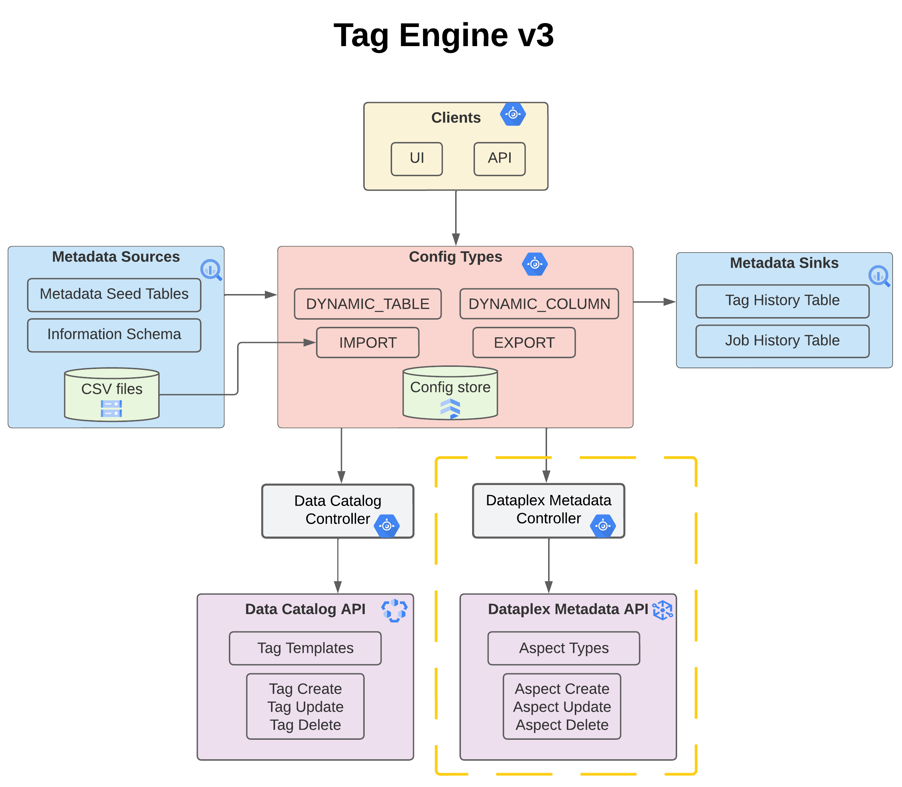

## Tag Engine 3.0
This is the Dataplex branch for Tag Engine. Tag Engine v3 is the newest flavor of Tag Engine that is compatible with both Data Catalog and Dataplex. It is based on the Cloud Run branch and therefore supports VPC-SC, user authentication, role based access control. 

*As of this writing (2024-10-13), Tag Engine's Dataplex support is limited to the import, dynamic table, and dynamic column config types. See [Part 2](#test-dataplex) of this guide for more details. Note: Only the Tag Engine API supports operating on Dataplex aspects. Our plan is to add compatibility for the Tag Engine UI by end of year.*  

If you're not familiar with Tag Engine, it is an open-source tool which automates the metadata tagging of BigQuery, Cloud Storage, and Spanner data assets. It allows you to tag at the dataset level, table level, and field level. Tag Engine is used to import metadata from CSV files and it is also used for dynamic tagging where the metadata is sourced from BigQuery. With dynamic tagging, you create configurations that specify how to populate various fields of a tag or aspect using URI paths and SQL expressions. Tag Engine runs the configurations either on demand or on a schedule and carries out the tagging: creating new metadata tags, updating existing tags or deleting them when they are no longer needed.



This README file describes the deployment steps, testing procedures, and some code samples. It is organized into 6 sections:  <br>
- Part 1: [Deploying Tag Engine v3](#deploy) <br>
- Part 2: [Testing your Tag Engine API Setup with Dataplex](#test-dataplex)
- Part 3: [Testing your Tag Engine API Setup with Data Catalog](#test-api)  <br>
- Part 4: [Testing your Tag Engine UI Setup with Data Catalog](#test-ui)  <br>
- Part 5: [Troubleshooting](#troubleshooting)  <br>
- Part 6: [Code Samples](#code-samples)  <br>

### <a name="deploy"></a> Part 1: Deploying Tag Engine v3

Tag Engine v3 (just like Tag Engine v2) comes with two Cloud Run services. One service is for the API (`tag-engine-api`) and the other is for the UI (`tag-engine-ui`). 

Both services use access tokens for authorization. The API service expects the client to pass in an access token when calling the API functions (`gcloud auth print-identity-token`) whereas the UI service uses OAuth to authorize the client from the front-end. Note that a client secret file is required for the OAuth flow.  

Follow the steps below to deploy Tag Engine with Terraform. 

Alternatively, you may choose to deploy Tag Engine with [gcloud commands](https://github.com/GoogleCloudPlatform/datacatalog-tag-engine/tree/cloud-run/docs/manual_deployment.md) instead of running the Terraform.

1. Create (or designate) two service accounts: <br>
   - A service account that runs the Tag Engine Cloud Run services (both API and UI). This account is referred to as `TAG_ENGINE_SA`. 
   - A service account that sources the metadata from BigQuery or Cloud Storage, and then performs the tagging in Data Catalog. This account is referred to as `TAG_CREATOR_SA`. <br>

   See [Creating Service Accounts](https://cloud.google.com/iam/docs/service-accounts-create) for more details.

   Why do we need two different service accounts? The key benefit of decoupling them is to allow individual teams to have their own Tag Creator SA. This account has permissions to read specific data assets in BigQuery and Cloud Storage. For example, the Finance team can have a different Tag Creator SA from the Finance team if they own different data assets. The Tag Engine admin then links each invoker account (either service or user) to a specific Tag Creator SA. Invoker accounts call Tag Engine through either the API or UI. This allows the Tag Engine admin to run and maintain a single instance of Tag Engine, as opposed to one instance per team. <br>

2. Create an OAuth client:

   Open [API Credentials](https://console.cloud.google.com/apis/credentials).<br>

   Click on Create Credentials and select OAuth client ID and choose the following settings:<br>

   Application type: web application<br>
   Name: tag-engine-oauth<br>
   Authorized redirects URIs: <i>Leave this field blank for now.</i>  
   Click Create<br>
   Download the credentials as `te_client_secret.json` and place the file in the root of the `datacatalog-tag-engine` directory<br>

   Note: The client secret file is required for establishing the authorization flow from the UI.  

3. Create a new GCS bucket for CSV imports. Remember GCS bucket names are globally unique. 
	For example: `gsutil mb gs://$(gcloud config get-value project)-csv-import`

4. Set the Terraform variables:

   Open `deploy/variables.tf` and change the default value of each variable.<br>
   Save the file.<br><br> 
   Alternatively, create a new file, named `deploy/terrform.tfvars` and specify your variables values there.  


5. Run the Terraform scripts:
	
	__NOTE__: The terraform script will run with the default credentials currently configured on your system. Make sure that your current user has the required permissions to make changes to your project(s), or set new credentials using the `GOOGLE APPLICATION_CREDENTIALS` environment variable.
	
	```
	cd deploy
	terraform init
	terraform plan
	terraform apply
	```

	When the Terraform finishes running, it should output two URIs. One for the API service (which looks like this https://tag-engine-api-xxxxxxxxxxxxx.a.run.app) and another for the UI service (which looks like this https://tag-engine-ui-xxxxxxxxxxxxx.a.run.app). <br><br>


6. The terraform script has created the tag engine configuration file (`datacatalog-tag-engine/tagengine.ini`). Open the file and verify the content, modifying if needed: 
	```
	TAG_ENGINE_SA
	TAG_CREATOR_SA
	TAG_ENGINE_PROJECT
	TAG_ENGINE_REGION
	FIRESTORE_PROJECT
	FIRESTORE_REGION
	FIRESTORE_DATABASE 
	BIGQUERY_REGION
	FILESET_REGION
	SPANNER_REGION
	ENABLE_AUTH
	OAUTH_CLIENT_CREDENTIALS
	ENABLE_TAG_HISTORY
	TAG_HISTORY_PROJECT
	TAG_HISTORY_DATASET
	ENABLE_JOB_METADATA
	JOB_METADATA_PROJECT
	JOB_METADATA_DATASET  
	```

   A couple of notes: <br>

   - The variable `ENABLE_AUTH` is a boolean. When set to `True`, Tag Engine verifies that the end user is authorized to use `TAG_CREATOR_SA` prior to processing their tag requests. This is the recommended value. <br>

   - The `tagengine.ini` file also has two additional variables, `INJECTOR_QUEUE` and `WORK_QUEUE`. These determine the names of the cloud task queues. You do not need to change them. If you change their name, you need to also change them in the `deploy/variables.tf`.<br><br> 


### <a name="test-dataplex"></a> Part 2: Testing your Tag Engine API setup with Dataplex

1. Create the sample `data-governance` aspect type:

	```
	git clone https://github.com/GoogleCloudPlatform/datacatalog-templates.git 
	cd aspect_types
	python create_aspect_type.py $DATAPLEX_PROJECT $DATAPLEX_REGION aspect_types/data-governance.yaml 
	```

2. Grant permissions to invoker account (user or service):

	Depending on how you are involving the Tag Engine API, you'll need to grant permissions to either your service account or user account (or both). 

	If you'll be invoking the Tag Engine API with a user account, authorize your user account as follows:

	```
	gcloud auth login
	
	export INVOKER_USER_ACCOUNT="username@example.com"

	gcloud iam service-accounts add-iam-policy-binding $TAG_CREATOR_SA \
	--member=user:$INVOKER_USER_ACCOUNT --role=roles/iam.serviceAccountUser --project=$DATA_CATALOG_PROJECT

	gcloud run services add-iam-policy-binding tag-engine-api \
	--member=user:$INVOKER_USER_ACCOUNT --role=roles/run.invoker --project=$TAG_ENGINE_PROJECT --region=$TAG_ENGINE_REGION 
	```

	If you are invoking the Tag Engine API with a service account, authorize your service account as follows:

	```
	export INVOKER_SERVICE_ACCOUNT="tag-engine-invoker@<PROJECT>.iam.gserviceaccount.com"

	gcloud iam service-accounts add-iam-policy-binding $TAG_CREATOR_SA \
	--member=serviceAccount:$INVOKER_SERVICE_ACCOUNT --role=roles/iam.serviceAccountUser 

	gcloud run services add-iam-policy-binding tag-engine-api \
	--member=serviceAccount:$INVOKER_SERVICE_ACCOUNT --role=roles/run.invoker --region=$TAG_ENGINE_REGION	
	```

	<b>Very important: Tag Engine requires that these roles be directly attached to your invoker account(s).</b> 


3.  Run the following commands to create Dataplex aspects from CSV files:
	
	Copy `examples/configs/import/sample_data/bigquery_table_aspects.csv` to your own GCS bucket. 
		
	Open `examples/configs/import/aspect_types/bigquery_table_config.json` and change the `aspect_type_project`, `aspect_type_region`, and `metadata_import_location` to point to your Dataplex project, region and GCS bucket, respectively. 
	
	```
	export IAM_TOKEN=$(gcloud auth print-identity-token)
	
	curl -X POST $TAG_ENGINE_URL/create_import_config -d @examples/configs/import/aspect_types/bigquery_table_config.json \
	 -H "Authorization: Bearer $IAM_TOKEN"
	 
	curl -i -X POST $TAG_ENGINE_URL/trigger_job \
	-d '{"config_type":"TAG_IMPORT","config_uuid":"23b772a24f7011efbbe242004e494300"}' \
	-H "Authorization: Bearer $IAM_TOKEN"

	curl -X POST $TAG_ENGINE_URL/get_job_status -d '{"job_uuid":"23440e26501e11ef9de142004e494300"}' \
	-H "Authorization: Bearer $IAM_TOKEN"
	```
	
	Please note that you need to replace the `config_uuid` and `job_uuid` with your own values! 


3.  Run the following commands to create dynamic table-level aspects from BQ metadata:

	Open `examples/configs/dynamic_table/aspect_types/dynamic_table_ondemand.json` and change the `aspect_type_project`, `aspect_type_region`, 
	and `included_tables_uris` to point to your Dataplex project, region, and BQ tables, respectively. 
	
	```
	export IAM_TOKEN=$(gcloud auth print-identity-token)
	
	curl -X POST $TAG_ENGINE_URL/create_dynamic_table_config \
	-d @examples/configs/dynamic_table/aspect_types/dynamic_table_ondemand.json \
	-H "Authorization: Bearer $IAM_TOKEN"
	 
	curl -i -X POST $TAG_ENGINE_URL/trigger_job \
	-d '{"config_type":"DYNAMIC_TAG_TABLE","config_uuid":"59c51d0689ac11efb20b42004e494300"}' \
	-H "Authorization: Bearer $IAM_TOKEN"

	curl -X POST $TAG_ENGINE_URL/get_job_status -d '{"job_uuid":"2679a3f66fa611efae5242004e494300"}' \
	-H "Authorization: Bearer $IAM_TOKEN"
	```
	
	Please note that you need to replace the `config_uuid` and `job_uuid` with your own values!


4.  Run the following commands to create dynamic column-level aspects from BQ metadata:

	Open `examples/configs/dynamic_column/aspect_types/dynamic_column_ondemand.json` and change the `aspect_type_project`, `aspect_type_region`, 
	`included_columns_query`, and `included_tables_uris` to point to your Dataplex project, region, BQ columns, and BQ tables, respectively. 
	
	```
	export IAM_TOKEN=$(gcloud auth print-identity-token)
	
	curl -X POST $TAG_ENGINE_URL/create_dynamic_column_config \
	-d @examples/configs/dynamic_table/aspect_types/dynamic_column_ondemand.json \
	-H "Authorization: Bearer $IAM_TOKEN"
	 
	curl -i -X POST $TAG_ENGINE_URL/trigger_job \
	-d '{"config_type":"DYNAMIC_TAG_COLUMN","config_uuid":"9aaaed5089cf11ef825b42004e494300"}' \
	-H "Authorization: Bearer $IAM_TOKEN"

	curl -X POST $TAG_ENGINE_URL/get_job_status -d '{"job_uuid":"b0a8e1de89cf11ef833d42004e494300"}' \
	-H "Authorization: Bearer $IAM_TOKEN"
	```
	
	Please note that you need to replace the `config_uuid` and `job_uuid` with your own values!


### <a name="test-api"></a> Part 3: Testing your Tag Engine API setup with Data Catalog

1. Create the sample `data_governance` tag template:

	```
	git clone https://github.com/GoogleCloudPlatform/datacatalog-templates.git 
	cd datacatalog_templates
	python create_template.py $DATA_CATALOG_PROJECT $DATA_CATALOG_REGION data_governance.yaml 
	```

	The previous command creates the `data_governance` tag template in the `$DATA_CATALOG_PROJECT` and `$DATA_CATALOG_REGION`. 


2. Grant permissions to invoker account (user or service):

	Depending on how you are involving the Tag Engine API, you'll need to grant permissions to either your service account or user account (or both). 

	If you'll be invoking the Tag Engine API with a user account, authorize your user account as follows:

	```
	gcloud auth login
	
	export INVOKER_USER_ACCOUNT="username@example.com"

	gcloud iam service-accounts add-iam-policy-binding $TAG_CREATOR_SA \
	--member=user:$INVOKER_USER_ACCOUNT --role=roles/iam.serviceAccountUser --project=$DATA_CATALOG_PROJECT

	gcloud run services add-iam-policy-binding tag-engine-api \
	--member=user:$INVOKER_USER_ACCOUNT --role=roles/run.invoker \
	--project=$TAG_ENGINE_PROJECT --region=$TAG_ENGINE_REGION 
	```

	If you are invoking the Tag Engine API with a service account, authorize your service account as follows:

	```
	export INVOKER_SERVICE_ACCOUNT="tag-engine-invoker@<PROJECT>.iam.gserviceaccount.com"

	gcloud iam service-accounts add-iam-policy-binding $TAG_CREATOR_SA \
		--member=serviceAccount:$INVOKER_SERVICE_ACCOUNT --role=roles/iam.serviceAccountUser 

	gcloud run services add-iam-policy-binding tag-engine-api \
		--member=serviceAccount:$INVOKER_SERVICE_ACCOUNT --role=roles/run.invoker \
		--region=$TAG_ENGINE_REGION	
	```

	<b>Very important: Tag Engine requires that these roles be directly attached to your invoker account(s).</b> 

3. Generate an IAM token (aka Bearer token) for authenticating to Tag Engine: 

	If you are invoking Tag Engine with a user account, run `gcloud auth login` and authenticate with your user account. 
	If you are invoking Tag Engine with a service account, set `GOOGLE_APPLICATION_CREDENTIALS`. 

	```
	export IAM_TOKEN=$(gcloud auth print-identity-token)
	```

4. Create your first Tag Engine configuration:

	Tag Engine uses configurations (configs for short) to define tag requests. There are several types of configs from ones that create dynamic table-level tags to ones that create tags from CSV. You'll find several example configs in the `examples/configs/` subfolders.

	For now, open `examples/configs/dynamic_table/dynamic_table_ondemand.json` and update the project and dataset values in this file to match your Tag Engine and BigQuery environments.  

	```
    cd datacatalog-tag-engine
	export TAG_ENGINE_URL=$SERVICE_URL

	curl -X POST $TAG_ENGINE_URL/create_dynamic_table_config -d @examples/configs/dynamic_table/dynamic_table_ondemand.json \
		 -H "Authorization: Bearer $IAM_TOKEN"
	```

	Note: `$SERVICE_URL` should be equal to your Cloud Run URL for `tag-engine-api`. 

	The output from the previous command should look similar to:

	```
	{"config_type":"DYNAMIC_TAG_TABLE","config_uuid":"facb59187f1711eebe2b4f918967d564"}
	```

5. Run your first job:

	Now that we have created a config, we need to trigger it in order to create the tags. A Tag Engine job is an execution of a config. In this step, you execute the dynamic table config using the config_uuid from the previous step. 

	Note: Before running the next command, please update the `config_uuid` with your own value. 

	```
	curl -i -X POST $TAG_ENGINE_URL/trigger_job \
		-d '{"config_type":"DYNAMIC_TAG_TABLE","config_uuid":"facb59187f1711eebe2b4f918967d564"}' \
		-H "Authorization: Bearer $IAM_TOKEN"
	```

	The output from the previous command should look similar to:

	```
	{
		"job_uuid": "069a312e7f1811ee87244f918967d564"
	}
	```

	If you enabled job metadata in `tagengine.ini`, you can optionally pass a job metadata object to the trigger_job call. This gets stored in BigQuery, along with the job execution details. Please note that the job metadata option is not required, you can skip this step:
	
	```
	curl -i -X POST $TAG_ENGINE_URL/trigger_job \
		-d '{"config_type":"DYNAMIC_TAG_TABLE","config_uuid":"c255f764d56711edb96eb170f969c0af","job_metadata": {"source": "Collibra", 		"workflow": "process_sensitive_data"}}' \
		-H "Authorization: Bearer $IAM_TOKEN"
	```
	
	The job metadata parameter gets written into a BigQuery table that is associated with the job_uuid. 


6. View your job status:

	Note: Before running the next command, please update the `job_uuid` with your value. 

	```
	curl -X POST $TAG_ENGINE_URL/get_job_status -d '{"job_uuid":"069a312e7f1811ee87244f918967d564"}' \
		-H "Authorization: Bearer $IAM_TOKEN"
	```

	The output from this command should look like this:

	```
		{
	  	  "job_status": "SUCCESS",
	  	  "task_count": 1,
	  	  "tasks_completed": 1,
	  	  "tasks_failed": 0,
	  	  "tasks_ran": 1
	}
	```
	
	Open the Data Catalog UI and verify that your tag was successfully created. If your tag is not there or if you encounter an error with the previous commands, open the Cloud Run logs for the `tag-engine-api` service and investigate. 

<br>

### <a name="test-ui"></a> Part 4: Testing your Tag Engine UI Setup with Data Catalog

1. Set the authorized redirect URI and add authorized users:

    - Re-open [API Credentials](https://console.cloud.google.com/apis/credentials)<br>

    - Under OAuth 2.0 Client IDs, edit the `tag-engine-oauth` entry which you created earlier. <br>

    - Under Authorized redirect URIs, add the URI:
      https://tag-engine-ui-xxxxxxxxxxxxx.a.run.app/oauth2callback
	
    - Replace xxxxxxxxxxxxx in the URI with the actual value from the Terraform. This URI will be referred to below as the `UI_SERVICE_URI`.

    - Open the OAuth consent screen page and under the Test users section, click on add users.

    - Add the email address of each user for which you would like to grant access to the Tag Engine UI. 

2. Grant permissions to your invoker user account(s):

    ```
    export INVOKER_USER_ACCOUNT="username@example.com"`

    gcloud iam service-accounts add-iam-policy-binding $TAG_CREATOR_SA \
        --member=user:$INVOKER_USER_ACCOUNT --role=roles/iam.serviceAccountUser
    ```

3. Open a browser window
4. Navigate to `UI_SERVICE_URI` 
5. You should be prompted to sign in with Google
6. Once signed in, you will be redirected to the Tag Engine home page (i.e. `UI_SERVICE_URI`/home)
7. Enter your template id, template project, and template region
8. Enter your `TAG_CREATOR_SA` as the service account
9. Click on `Search Tag Templates` to continue to the next step 
10. Create a tag configuration by selecting one of the options from this page. 

     If you encounter a 500 error, open the Cloud Run logs for `tag-engine-ui` to troubleshoot. 
<br>

### <a name="troubleshooting"></a> Part 5: Troubleshooting

There is a known issue with the Terraform. If you encounter the error `The requested URL was not found on this server` when you try to create a configuration from the API, the issue is that the container didn't build correctly. Try to rebuild and redeploy the Cloud Run API service with this command:

```
    cd datacatalog-tag-engine
    gcloud run deploy tag-engine-api \
 	--source . \
 	--platform managed \
 	--region $TAG_ENGINE_REGION \
 	--no-allow-unauthenticated \
 	--ingress=all \
 	--memory=4G \
	--timeout=60m \
 	--service-account=$TAG_ENGINE_SA
```

Then, call the `ping` endpoint as follows:

```
    curl $TAG_ENGINE_URL/ping -H "Authorization: Bearer $IAM_TOKEN"
```

You should see the following response:

```
    Tag Engine is alive
```

### <a name="code-samples"></a> Part 6: Code Samples

1. Explore additional API methods and run them through curl commands:

   Open `examples/unit_test.sh` and go through the different methods for interracting with Tag Engine, including `configure_tag_history`, `create_static_asset_config`, `create_dynamic_column_config`, etc. <br>

2. Explore the sample scripts library:

   There are multiple samples scripts in the `examples/scripts` folder. These are intended to help you get started with the Tag Engine API. 

   Before running the scripts, open each file and update the `TAG_ENGINE_URL` variable on line 11 with your own Cloud Run service URL. You'll also need to update the project and dataset values which may be in the script itself or in the referenced json config file. 

   Here are some of the scripts that you can look at:

	```
	python configure_tag_history.py
	python create_static_config_trigger_job.py
	python create_dynamic_table_config_trigger_job.py
	python create_dynamic_column_config_trigger_job
	python create_dynamic_dataset_config_trigger_job.py
	python create_import_config_trigger_job.py
	python create_export_config_trigger_job.py
	python list_configs.py
	python read_config.py
	python purge_inactive_configs.py
	```

3. Explore sample workflows:

   The `extensions/orchestration/` folder contains some sample workflows implemented in Cloud Workflow. The `trigger_tag_export.yaml` and `trigger_tag_export_import.yaml` show how to orchestrate Tag Engine jobs. To run the workflows, enable the Cloud Workflows API (`workflows.googleapis.com`) and then follow these steps:

	```
	gcloud workflows deploy orchestrate-jobs --location=$TAG_ENGINE_REGION \
		--source=trigger_export_import.yaml --service-account=$CLOUD_RUN_SA

	gcloud workflows run trigger_export_import --location=$TAG_ENGINE_REGION
	```
	In addition to the Cloud Workflow examples, there are two examples for Airflow in the same folder, `dynamic_tag_update.py` and `pii_classification_dag.py`.  

<br>

4. Create your own Tag Engine configs with the API and/or UI. <br>

<br>

5. Open new [issues](https://github.com/GoogleCloudPlatform/datacatalog-tag-engine/issues) if you encounter bugs or would like to request a new feature or extension. 
