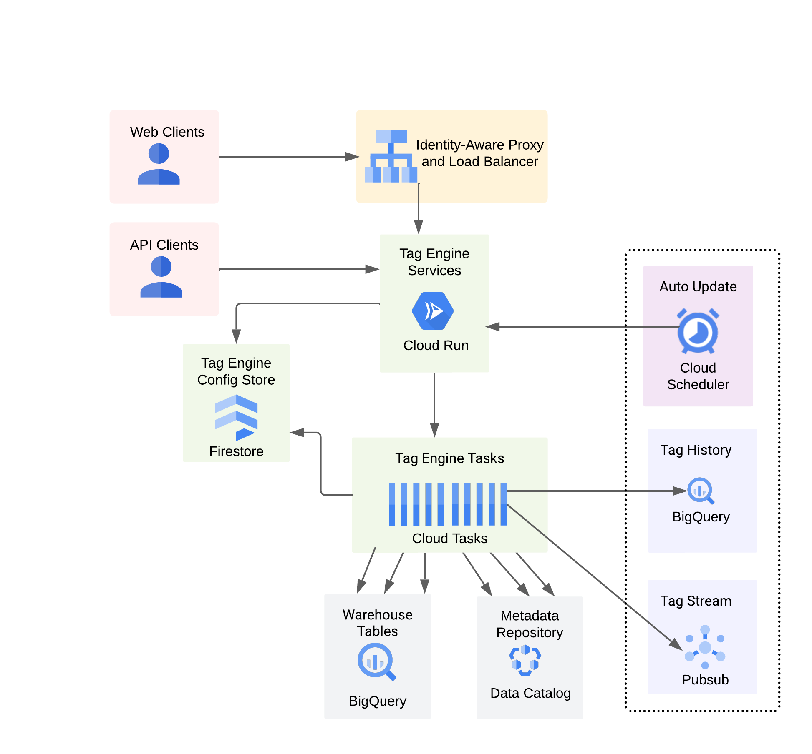

### Deploying Tag Engine v2 behind an external load balancer

This deployment uses an HTTP global external load balancer and IAP in addition to Cloud Run. 

It also uses a domain for the URL of the Tag Engine UI (instead of the IP address of the load balancer). 

Here's a high-level diagram of the main components: <br>

The first 5 steps are manual, the last step is done with Terraform. 

1. Create (or designate) two service accounts:

	- A service account that runs the Tag Engine Cloud Run service, referred to as `TAG_ENGINE_SA`. 
	- A service account that performs the tagging in Data Catalog, and sourcing the contents of those tags from BigQuery, referred to as `TAG_CREATOR_SA`. <br><br>


2. Register and purchase a domain (<i>skip this step if you already have a domain</i>):

   Enable the [Cloud DNS API](https://console.cloud.google.com/marketplace/product/google/dns.googleapis.com)<br>
   Open [Cloud Domains](https://console.cloud.google.com/net-services/domains/registrations/list) and register a domain for your Tag Engine UI.<br><br>


3. Create a pair of OAuth clients:

   Open [API Credentials](https://console.cloud.google.com/apis/credentials)<br>

   Click on Create Credentials and select OAuth client ID and choose the following settings:<br>

   Application type: web application<br>
   Name: tag-engine-oauth<br>
   Authorized redirects URIs: https://[YOUR_DOMAIN]/oauth2callback<br> 
   Click Create<br>
   Download the credentials as `client_secret.json` and place the file in the root of the `datacatalog-tag-engine` directory<br> 

   Note: [YOUR_DOMAIN] refers to your domain name (e.g. tagengine.app)<br><br> 

   Click on Create Credentials and select OAuth client ID and choose the following settings:<br>

   Application type: web application<br>
   Name: IAP-tag-engine-backend<br>
   Click Create<br>

   Reopen IAP-tag-engine-backend<br> 
   Copy the Client ID<br>
   Add authorized redirect URI: https://iap.googleapis.com/v1/oauth/clientIds/[CLIENT_ID].apps.googleusercontent.com:handleRedirect<br>
   Click Save<br>

   Note: [CLIENT_ID] refers to your OAuth client ID (e.g. 111111111111-xxxxxxxxxxxxxxxxxxxxxxxxxxxxxxx.apps.googleusercontent.com)<br><br>


4. Open `datacatalog-tag-engine/tagengine.ini` and set the following variables in this file: 

	```
	TAG_ENGINE_PROJECT
	TAG_ENGINE_REGION  
	BIGQUERY_REGION
	TAG_ENGINE_SA
	TAG_CREATOR_SA
	OAUTH_CLIENT_CREDENTIALS
	ENABLE_AUTH
	TAG_HISTORY_PROJECT
	TAG_HISTORY_DATASET
	ENABLE_JOB_METADATA
	JOB_METADATA_PROJECT
	JOB_METADATA_DATASET     
	```

   A couple of notes: <br>

   - The variable `ENABLE_AUTH` is a boolean. When set to `True`, Tag Engine verifies that the end user is authorized to use `TAG_CREATOR_SA` prior to    processing their tag requests. This is the recommended value. <br>

   - The `tagengine.ini` file also has two variables, `INJECTOR_QUEUE` and `WORK_QUEUE`. Those determine the names of the cloud task queues. You do not need to change them. If you change their name, you need to also change them in the `deploy/variables.tf`.<br><br> 


5. Set the Terraform variables:

   Open `deploy/external_load_balancer/variables.tf` and change the default value for each variable.<br>
   Open `deploy/external_load_balancer/terraform.tfvars` and set the three remaining variables. <br>
   Save both files.<br><br> 


6. Run the Terraform scripts:

	```
	cd deploy/external_load_balancer
	terraform init
	terraform plan
	terraform apply
	```

Once the Terraform completes, consult the test procedures [Testing your Setup with a User Account](https://github.com/GoogleCloudPlatform/datacatalog-tag-engine/blob/cloud-run/README.md#testa) and [Testing your Setup with a Service Account](https://github.com/GoogleCloudPlatform/datacatalog-tag-engine/blob/cloud-run/README.md#testb) for next steps. 
